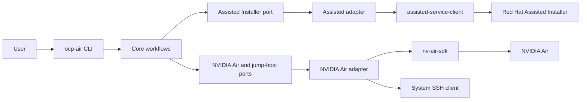
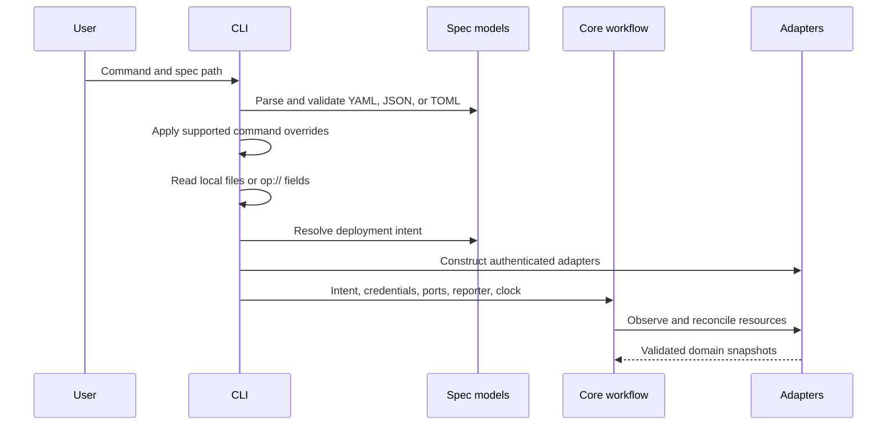

# Architecture

This document explains how `ocp-dsx-air` separates deployment policy from the
Assisted Installer and NVIDIA Air SDKs. See [Lab lifecycle](lifecycle.md) for the
ordered behavior of a deployment.

## System context

Assisted Installer owns the OpenShift cluster definition, InfraEnv, host
inventory, installation, and cluster credentials. NVIDIA Air owns images, the
simulation topology, virtual machine lifecycle, and the external SSH service.

The discovery ISO connects the systems. Assisted Installer generates it. The
deployment uploads it to Air and attaches it to each OpenShift node. The nodes
then register with the Assisted cluster.

## Dependency direction

| Layer | Responsibility |
| --- | --- |
| `cli` | Parse commands, load credentials, construct adapters, and translate errors into terminal output. |
| `models` | Parse and validate the spec, then resolve it into deployment intent. |
| `core` | Define domain contracts, decisions, ports, and workflows without SDK model types. |
| `adapters` | Translate between domain contracts and third-party SDK calls and responses. |

Core workflows receive implementations of `AirPort`,
`AssistedInstallerPort`, and `JumpHostPort`. Tests can run the complete
workflow with fakes while adapter tests exercise SDK behavior separately.

SDK objects do not cross a port boundary. Each adapter validates the fields it
needs and converts a response into an immutable domain snapshot. A missing,
ambiguous, malformed, or unknown required value raises a boundary error. The
workflow does not interpret malformed data as an absent resource.

## Configuration and credential flow

Local credential paths can contain `~` or `${ENV_VAR}`. An `op://` value is
read once with `op read --no-newline`; each call has a 120-second timeout.
Errors identify the configuration field and suppress subprocess output.

Deploy resolves all five credentials before it constructs service clients.
Destroy reads the Air API key and Assisted offline token. Tunnel and console
read only the Air API key.

## Intent, observations, and decisions

The validated spec becomes a `DeployIntent`. It contains resource names,
networking, node and link topology, cache paths, and timeouts. It does not
contain remote resource IDs.

For each resource, a workflow obtains a snapshot and selects an action:

- create an absent resource;
- wait for a recognized asynchronous operation;
- reuse a compatible resource;
- reject material drift;
- reject an unsupported or unknown state.

The adapters mutate remote resources only after the workflow selects an action.
The workflow observes a resource again after mutation instead of assuming that
the request completed synchronously.

## Ownership and drift

Exact-name lookup is necessary but does not prove compatibility. Decisions
compare material cluster, InfraEnv, image, simulation, node, and link fields.

Air simulations include project metadata with a schema version, managed node
names, and a topology SHA-256 digest. Air image snapshots include the SDK
ownership flag and validated content metadata. These checks prevent changes to
an unrelated same-name Air resource.

Deployment checks discoverable ownership conflicts before its first mutation.
Destruction applies the same protection. A narrow exception permits deletion of
an exact-name `INVALID` simulation so a failed older import can be recovered.

## Error boundaries

The CLI catches configuration, validation, operating-system, and project domain
errors. It prints a command-specific prefix such as `Deployment failed:` or
`Destroy failed:` and exits with status 1.

Transport adapters expose an operation label, HTTP status when available, and a
stable description. They suppress response bodies, headers, model
representations, signed URLs, credentials, and subprocess output.

## Local artifacts

The project uses the platform-specific user cache directory, partitioned by
simulation name. It stores discovery media, blank-disk data and metadata,
cluster credentials, the tunneled kubeconfig, and the console browser profile.

Sensitive downloads are written atomically with owner-only permissions. The
tunnel writes `kubeconfig.tunnel` atomically with mode `0600` and retains TLS
verification through the original API hostname. Destroy does not remove local
artifacts.
