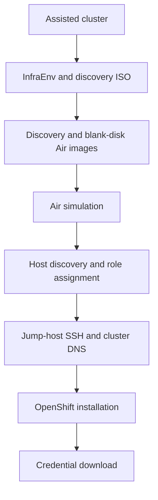

# Lab lifecycle

`ocp-air deploy` compares the desired spec with current Assisted Installer and
NVIDIA Air resources, then performs the next valid action for each stage.

## Deployment order



1. **Cluster:** Find the exact cluster name. Create it when absent, or validate
   and reuse it.
2. **InfraEnv:** Find or create `<cluster-name>_infra-env`. Wait for its minimal
   discovery ISO, then download it to the simulation cache.
3. **Air images:** Reuse or create a compatible blank-disk image. Create and
   upload the InfraEnv-specific discovery image.
4. **Simulation:** Import the topology, verify organization capacity, start the
   simulation, and wait for `ACTIVE`.
5. **Host discovery:** Match each Assisted host to an expected node by requested
   or inventory hostname, then assign its control-plane or worker role.
6. **Jump host:** Find or create the SSH service, replace the factory password,
   verify key authentication, and add cluster DNS records to the management node.
7. **Installation:** Wait for all required hosts, configure networking, start
   installation when allowed, and poll until completion.
8. **Credentials:** Download `kubeconfig` and `kubeadmin-password`.

Each asynchronous mutation is followed by another observation. The workflow
polls recognized transitional states and fails on unknown or unsafe states.

## Explicit simulation lifecycle

The `status`, `start`, `stop`, and `restart` commands operate an existing
simulation without running deployment reconciliation. Read-only status can
report an unmanaged exact-name simulation. Lifecycle mutations require this
project's management metadata.

`start` waits for `ACTIVE`. It joins an existing startup, or waits for an
existing checkpoint-preserving shutdown to reach `INACTIVE` before it checks
capacity and submits one start request.

`stop` calls Air shutdown with checkpoint creation enabled. Its default mode
returns after request acceptance and one immediate observation. `stop --wait`
continues observing until `INACTIVE`. A local timeout does not cancel the Air
operation.

`restart` uses one deadline for the complete operation. It joins an existing
shutdown or requests a checkpoint-preserving shutdown, waits for `INACTIVE`,
checks capacity, submits one start request, and waits for `ACTIVE`. Restart
refuses an in-progress startup because stopping a partially started simulation
is not a safe implicit action.

The access commands accept `--start`. After the simulation reaches `ACTIVE`,
they repeatedly resolve the jump-host service and test its current TCP endpoint
for up to five minutes. They do not retain an endpoint from before the wake-up.

## Safe reruns

After an interruption, run the same command:

```sh
uv run ocp-air deploy --spec spec.yaml
```

The workflow reuses compatible completed resources and continues recognized
operations. If installation has started, the matching Air simulation must still
exist and remain compatible.

Material drift stops reconciliation. The error lists paths that differ. Restore
the previous intent or review and perform a full replacement.

## Simulation capacity

Before starting an inactive simulation, the Air adapter gets all nodes,
including automatic out-of-band nodes, and exactly one organization resource
budget. It checks total CPU, memory, storage, and the per-node storage limit.

Missing, malformed, or ambiguous budget data fails closed. An insufficient
capacity error reports required and available resources. If the first
observation after start remains `INACTIVE`, capacity is checked once more to
detect a concurrent allocation. The Air start endpoint remains authoritative
because checking and starting are separate requests.

## Host discovery

Assisted Installer can temporarily use a host UUID as its hostname. The adapter
treats a bare UUID or `@UUID` as unset until a real hostname appears.

Hosts are matched by name, never by discovery order. An unexpected stable name
fails deployment. Temporary validations such as NTP synchronization and
majority connectivity are reported while discovery continues. Terminal host or
cluster states still fail immediately.

The default discovery timeout is the larger of 20 minutes or 8 minutes per
expected host. `--discovery-timeout MINUTES` replaces it.

## Installation

For three control-plane nodes, the workflow applies the configured machine
network, API VIPs, and Ingress VIPs. For a single-node deployment, it derives
the API and Ingress address from the discovered control-plane host.

A ready cluster receives one installation request. A later run observes and
polls an installing cluster. An installed cluster proceeds to credential
download after the Air simulation and host topology are validated.

## Full replacement

```sh
uv run ocp-air deploy --spec spec.yaml --replace
```

`--replace` invokes the same teardown workflow as `ocp-air destroy`, then
starts a new deployment. It preserves local cache files and the reusable
blank-disk image.

## Destruction order

Before deletion, the workflow discovers all targets and validates Air ownership.
It then:

1. shuts down an active simulation without a checkpoint;
2. deletes the inactive or invalid simulation and waits for absence;
3. deletes the managed discovery image and waits for absence;
4. deregisters matching InfraEnv hosts;
5. deletes the InfraEnv and waits for absence;
6. deletes the Assisted cluster and waits for absence.

Absent resources are successful. If both the simulation and InfraEnv are absent,
the workflow cannot derive an orphaned discovery-image name and does not guess
one. Shared blank-disk images and local artifacts remain.
